# Jira Epic Run

Run a Jira Epic as the parent orchestrator. Use `jira-epic-state` before bootstrap, resume, dispatch, merge, closeout, or handoff. The parent owns durable state, Jira coordination, worktree creation, merge gates, and final closeout. Worker agents are `general-purpose` subagents with explicit role prompts and explicit `model_override` values.

Do not use Epic-specific subagent definition files. Do not treat this as a one-shot tasker flow. This is a runtime loop.

## Constants

All values in this block are site-specific placeholders — replace them with your own project values before first use.

- Atlassian cloudId: `<ATLASSIAN_CLOUD_ID>`
- Jira project: `<PROJECT_KEY>`
- Transitions: To Do `<TO_DO_ID>`, In Progress `<IN_PROGRESS_ID>`, In Review `<IN_REVIEW_ID>`, Done `<DONE_ID>`. These IDs are board-specific, verified 2026-06-18; re-verify with `getTransitionsForJiraIssue` if the project board is reconfigured.

## Standard Review Panels

Use `general-purpose` for every Epic worker. The parent prompt defines the role:
planner, plan reviewer, implementor, implementation reviewer, docs writer, docs
reviewer, or final branch reviewer.

Producer workers use:

```text
model_override: default_model:full
```

### Standard review panel (plan, docs, epic review — three members)

| Panel member | model_override | Default tilt |
|---|---|---|
| Reviewer A | `@mg:arch` | Architecture, cross-task coherence, overengineering/underengineering, replace-vs-edit assessment |
| Reviewer B | `@mg:workhorse` | Coverage, completeness, conventions, omissions |
| Reviewer C | `@mg:review` | Adversarial contract review, ambiguity, integration risk |

### Implementation review panel (four members — adds focused test-quality reviewer)

| Panel member | model_override | Default tilt |
|---|---|---|
| Reviewer A | `@mg:arch` | Architecture, cross-task coherence, overengineering/underengineering, replace-vs-edit assessment |
| Reviewer B | `@mg:arch` | Mechanical correctness, edge cases, error handling, contract conformance. Production code only. |
| Reviewer C | `@mg:review` | Adversarial contract review, ambiguity, integration risk |
| Reviewer D | `@mg:workhorse` | Test quality: false-green detection, tautological assertions, tests that don't exercise the new behavior. Test code only. |

### Focused-lens principle

Each panel member has a distinct, narrow lens. Do not ask one reviewer to cover
another's focus area — breadth dilutes attention and produces shallow findings.
When a review surface is large enough to warrant additional scrutiny in a
specific area, spawn an extra focused reviewer with a single mandate rather than
broadening an existing reviewer's scope.

If a pinned `model_override` does not resolve, stop and ask the operator. Do not
silently substitute a weaker or different model.

Every Jira Epic task gets the same planning, implementation, and review intensity unless the operator explicitly overrides the workflow for this run.

## Review Loop Exit Condition

A plan, implementation, docs lane, or final Epic review generation is accepted only when:

1. the latest review panel reports no critical or high findings;
2. every finding from every prior review pass has a disposition recorded by the parent: `fixed`, `rebutted-accepted`, or `accepted-risk`; critical/high `accepted-risk` dispositions require an explicit operator acceptance note in the portable finding log;
3. **medium findings are fixed, not deferred.** There is no "follow-up" tier — any finding not fixed or rebutted in this pass is effectively dropped because no tracking mechanism outside the Epic state captures it. Fix the code, or rebut with a specific technical justification;
4. **low findings are fixed or explicitly rebutted** with a recorded justification in the finding log. Do not describe them as "future work" or "nice to have" — if it is worth flagging, it is worth resolving now;
5. the parent independently verifies the artifact, tests, git state, and required trailers where applicable.

A later clean review does not erase unresolved earlier findings. The parent maintains a portable finding log and routes it into the next producer prompt.

## Skeptic Gates

Two independent skeptic gates run **outside** the normal review loops. Each uses
a `general-purpose` subagent with `@mg:arch` — a different model
than the review panels, providing a fresh adversarial pass. The skeptic's verdict
is binding. When a skeptic rejects, the work goes back through the **full review
loop** (not straight to a second skeptic pass), so the review panel validates the
fix before the skeptic ever sees it again.

### Plan deferral skeptic (runs after plan review loop exits clean, before implementation)

The deferral skeptic reads:

- the accepted plan (`plan-<prefix>.md`),
- any proposed deferrals or `deferrals.jsonl` entries,
- the task scope from `task-<prefix>.md`.

Its mandate, with hostile/skeptical prompting:

- Is every deferral literally impossible to accomplish, or just hard?
- Has the planner attempted to solve the hard parts, or merely declared them unsolvable?
- Does the plan contain contingency-fallback language that pre-authorizes degradation? A plan step that says "if X is hard, do Y (the easy thing)" is an escape hatch. The plan should say "if X is hard, research and solve X."
- Are there `#[ignore]`d tests, stub functions, TODOs, or placeholder code paths baked into the plan?

If the skeptic rejects, the planner revises, the **plan review panel re-runs from scratch**, and then the skeptic runs again. The task does not enter implementation until the skeptic passes.

### Implementation completeness/correctness skeptic (runs after implementation review loop exits clean, before orchestrator test gate)

The completeness/correctness skeptic reads:

- the implementation diff on the task branch,
- the accepted plan,
- test files for `#[ignore]` attributes.

Its mandate:

- Are there `#[ignore]`d tests for behavior the plan requires?
- Are there stub functions, TODOs, placeholder code paths, or no-op implementations?
- Are there functions that exist but are never called or wired into the system?
- Are there missing call sites where the plan's behavior should be connected?
- Are there integration gaps between this task's output and downstream consumers?
- Does the implementation actually do what the plan says, or does it merely compile?

If the skeptic rejects, the implementor fixes, the **implementation review panel re-runs from scratch**, and then the skeptic runs again. The task does not enter the orchestrator test gate until the skeptic passes.

## Portable Finding Log And Deferrals

For each review scope, write `.current-epic/findings-<scope>.jsonl`. Use the task prefix for task reviews (`findings-A.jsonl`), the docs lane id for docs reviews (`findings-docs-A.jsonl`), and `findings-epic.jsonl` for final branch review. Each line is one finding or disposition update:

```json
{"schema_version":1,"finding_id":"A-plan-1-F3","scope":"A","task_prefix":"A","phase":"plan","generation":"planner-A1","reviewer":"Reviewer B","severity":"high","status":"open","summary":"...","evidence":["path:line"],"recommendation":"..."}
{"schema_version":1,"finding_id":"A-plan-1-F3","scope":"A","task_prefix":"A","phase":"plan","generation":"planner-A2","status":"fixed","disposition_by":"parent","notes":"Verified by Reviewer C in round 2"}
```

Required `phase` values are `plan`, `implementation`, `docs`, and `epic-review`. Required `status` values are `open`, `fixed`, `rebutted-accepted`, and `accepted-risk`. Stable finding ids must include the scope, phase, review generation, and finding number. Two records with the same `finding_id` but conflicting `scope` or `phase` are state corruption; stop and surface the conflict rather than applying latest-wins. Critical/high `accepted-risk` records must include an explicit operator acceptance note. The parent appends updates rather than rewriting prior records. Runtime-local reviewer result files under `.current-epic/runtime/polytoken/subagent-results/` are evidence only after folding; the portable finding log is the source of truth for review-loop exit and resume.

Any accepted risk, follow-up, skipped relevant test tier, narrowed task scope, or
other conscious deferral must also be appended immediately to
`.current-epic/deferrals.jsonl` using the schema in `jira-epic-state`. However,
deferrals are only permitted when something is **computationally impossible** —
not when it is hard, complicated, requires research, or involves a difficult
build-system integration. Every deferral must survive the plan deferral skeptic
gate (see Skeptic Gates above). The skeptic's verdict is binding. Do not record
a deferral the skeptic has not approved. Do not rely on chat, todos, or Jira
comments as the only record. Critical/high deferrals require an explicit operator
decision note. Every open deferral must be surfaced in the final Jira summary and
final operator message.

## Parent Responsibilities

The parent orchestrator owns:

- Jira Epic and task reads.
- `.current-epic/` creation and reconciliation.
- Task dependency and eligibility computation.
- Epic and task worktree creation.
- Subagent dispatch and job supervision.
- Plan reviewer and implementation reviewer loops.
- Task branch verification and task branch merges into the Epic branch.
- Final cross-task review.
- Linear documentation work and documentation review loops.
- Jira comments and transitions.
- Runtime handoff state.

Subagents do not coordinate with siblings, mutate `.current-epic/` coordination files, merge branches, or delete worktrees.

## Worktree Model

Start at the repository root. Create or enter an Epic worktree named for the Epic role, not the Jira project key:

```text
.worktrees/epic-73
```

Then `pushd .worktrees/epic-73`. Keep the parent pushed into the Epic worktree for the orchestration loop. All parent-relative file reads/writes and shell commands then resolve in the Epic worktree.

For each task, create a dedicated task worktree:

```text
.worktrees/epic-73-task-A
```

When spawning implementors and task reviewers, pass the task worktree as the subagent `cwd`. If the parent cwd is `.worktrees/epic-73`, use a relative value such as `../epic-73-task-A`. Polytoken validates the directory and makes it the subagent's cwd floor. The subagent cannot `popd` above that task worktree.

## Bootstrap

When `.current-epic/` does not exist:

1. Invoke `jira-epic-state`.
2. Fetch the Jira Epic and every related task once. Use Jira child relationships and relevant issue links. Fetch Confluence context only when a Jira issue links to product context needed to understand scope.
3. Assign stable task prefixes from an explicit order field if available, otherwise Jira child order: `A`, `B`, ..., `Z`, `AA`.
4. Write `.current-epic/manifest.txt`.
5. Write `.current-epic/dependencies.dot` from Jira blocking links.
6. Write `.current-epic/workflow.dot` with the Epic execution state-machine (see Workflow DOT below).
7. Flag both `.current-epic/dependencies.dot` and `.current-epic/workflow.dot` with `flag_important` using mode `included`. These files are compaction anchors: a compacted session must be able to reconstruct the task graph and the full workflow procedure from them without re-reading the skill body.
8. Write `.current-epic/task-<prefix>.md` for every task. Include Jira key, URL, title, status, description, acceptance criteria, dependencies, linked context, and relevant comments.
9. Initialize `.current-epic/task-state.json`, `.current-epic/merge-gate.json`, `.current-epic/events.log`, and `.current-epic/runtime/polytoken/`.
10. Append `.current-epic/` to `.gitignore` if absent.
11. Ask the operator to approve or edit the task routing table before dispatch. The routing table contains task prefixes, Jira keys, titles, dependencies, and intended parallelism. Also ask whether the parent should transition Jira task status automatically at merge and closeout (default: yes — transition to In Review at merge, Done at closeout). Record the operator's choice in `events.log`.

## Workflow DOT

Write this content to `.current-epic/workflow.dot` during bootstrap. It encodes the full task lifecycle, review-loop conditions, and Epic-level post-task flow.

```dot
digraph epic_workflow {
    rankdir=TB;
    node [fontname="Helvetica"];
    edge [fontname="Helvetica", fontsize=10];

    // ── Per-task lifecycle ──
    pending [label="pending", shape=box];
    planner [label="planner-spawned\n(planner-A<N> writes plan-<prefix>.md)\nmodel: default_model:full", shape=box];
    plan_review [label="plan review\n3-model panel:\n@mg:arch\n@mg:workhorse\n@mg:review", shape=diamond];
    plan_skeptic [label="plan deferral skeptic\n@mg:arch\nreads plan + deferrals\nfor escape hatches", shape=diamond];
    plan_authored [label="plan-authored", shape=box];
    implementor [label="implementor-spawned\n(implementor-A<N> commits on task branch)\nmodel: default_model:full", shape=box];
    impl_review [label="implementation review\n4-model panel:\n@mg:arch\n@mg:arch\n@mg:review\n@mg:workhorse", shape=diamond];
    impl_skeptic [label="completeness/correctness skeptic\n@mg:arch\nreads impl diff for stubs,\nignored tests, unwired code", shape=diamond];
    orch_test [label="orchestrator test gate\nparent runs just build + just test\nin task worktree\n(not delegated, no --no-verify)", shape=diamond];
    awaiting_merge [label="awaiting-merge", shape=box];
    merging [label="merging\nparent: rebase, squash-merge\nverify Task: trailer on epic branch", shape=box];
    completed [label="completed\n(Task: trailer verified\non epic branch)", shape=box, style=bold];
    blocked [label="blocked-failure\n(stop dispatch, surface\nexact task + error)", shape=octagon, style=filled, fillcolor=lightcoral];

    // ── Per-task transitions ──
    pending -> planner [label="all predecessors completed\nby git Task: trailer"];
    planner -> plan_review [label="plan file written + verified\n(Epic key, Task key, steps,\ntests, trailers, handoff)"];
    plan_review -> planner [label="critical/high open\n→ next planner generation\n(feed full finding log)"];
    plan_review -> plan_skeptic [label="EXIT: no critical/high +\nall prior findings dispositioned\n(fixed / rebutted-accepted /\naccepted-risk with operator note)"];
    plan_skeptic -> planner [label="REJECT: escape hatch or\nsolvable deferral found\n→ planner revises,\nFULL review re-runs"];
    plan_skeptic -> plan_authored [label="PASS: no escape hatches,\nno unacceptable deferrals"];
    plan_authored -> implementor [label="all predecessors completed +\nno open critical/high plan findings"];
    implementor -> impl_review [label="implementor reports ready\n(parent verifies git + tests,\ndoes NOT trust the claim)"];
    implementor -> blocked [label="implementor reports blocked"];
    impl_review -> implementor [label="critical/high open\n→ next implementor generation\n(feed finding log + branch state)"];
    impl_review -> impl_skeptic [label="EXIT: no critical/high +\nall prior findings dispositioned"];
    impl_skeptic -> implementor [label="REJECT: stubs, ignored tests,\nunwired code found\n→ implementor fixes,\nFULL review re-runs"];
    impl_skeptic -> orch_test [label="PASS: implementation complete,\nno stubs or gaps"];
    orch_test -> implementor [label="FAIL: just test fails\n→ dispatch implementor+\nreviewer subagents to fix,\nthen re-run skeptic + test"];
    orch_test -> awaiting_merge [label="PASS: just build && just test\nclean in task worktree"];
    awaiting_merge -> merging [label="merge-gate.json.holder acquired"];
    merging -> completed [label="Task: trailer verified\non epic branch +\ngate released"];

    // ── Review loop exit condition (applies to both plan and impl review) ──
    //
    // 1. Latest panel reports no critical/high findings.
    // 2. Every finding from every prior pass has a disposition:
    //    fixed, rebutted-accepted, or accepted-risk.
    //    Critical/high accepted-risk requires operator acceptance note.
    // 3. Medium findings fixed — no deferral, no "follow-up."
    // 4. Low findings fixed or explicitly rebutted with justification.
    // 5. Parent independently verifies artifact, tests, git state, trailers.
    //
    // A later clean review does NOT erase unresolved earlier findings.
    // The parent maintains findings-<scope>.jsonl as the source of truth.

    // ── Epic-level flow (after ALL tasks completed) ──
    test_sweep [label="test-adherence sweep\nunit + provider-double + integration + UI\nresearch gaps; synthesize sweep tasks", shape=diamond];
    epic_skeptic [label="epic closeout skeptic\n@mg:arch\nholistic pass across all tasks\nfor integration gaps, ignored tests,\nstubs, unwired code", shape=diamond];
    epic_review [label="final epic review\n3-model panel on epic branch\nvs base branch", shape=diamond];
    docs [label="documentation work\n(linear: one lane at a time)\nmodel: default_model:full", shape=box];
    docs_review [label="docs review\n3-model panel per lane", shape=diamond];
    closeout [label="closeout\nJira summary comment\nleave .current-epic/ in place\ndo NOT merge to main\nunless operator instructs", shape=box, style=bold];

    completed -> test_sweep [label="ALL manifest tasks have\nverified Task: trailers +\nmerge-gate.holder is null", style=dashed];
    test_sweep -> pending [label="mandatory gap found →\nsynthesize sweep task\n(dynamic task creation,\nfull pipeline with all gates)"];
    test_sweep -> epic_skeptic [label="coverage gaps fixed"];
    epic_skeptic -> pending [label="REJECT: integration gap or\nstub found → create new task\n(dynamic task creation,\nfull pipeline with all gates)"];
    epic_skeptic -> epic_review [label="PASS: no integration gaps"];
    epic_review -> epic_review [label="critical/high → fix\non epic branch\n(Epic: trailer only)"];
    epic_review -> docs [label="code review gate clean"];
    docs -> docs_review [label="docs lane written"];
    docs_review -> docs [label="critical/high →\nnext docs generation\n(same lane)"];
    docs_review -> docs [label="next lane\n(after current clean)", style=dashed];
    docs_review -> closeout [label="all lanes clean"];
}
```



## Resume

When `.current-epic/` exists:

1. Invoke `jira-epic-state`.
2. Reconcile portable state against git trailers.
3. Treat existing `plan-<prefix>.md` as `plan-authored` if no task trailer commit exists and `.current-epic/findings-<prefix>.jsonl` has no open critical/high plan findings.
4. Treat `.current-epic/runtime/polytoken/jobs.json` as advisory. Old job ids may be stale.
5. If `merge-gate.json.holder` exists:
   - If that task has a trailer commit, release the gate.
   - If no trailer exists, ask the operator whether the task is still actively merging or should be marked blocked.
6. Resume dispatch only after reconciliation writes a fresh `task-state.json`.

## Dispatch Loop

Repeat until all tasks are complete or a failure stops dispatch.

### 1. Compute Eligible Tasks

A task is eligible for planning when:

- Its phase is `pending`.
- Every predecessor in `dependencies.dot` is `completed` by git trailer.

A task is eligible for implementation when:

- Its phase is `plan-authored`.
- Every predecessor in `dependencies.dot` is `completed` by git trailer.
- Its latest plan review round has no unresolved critical or high finding.

### 2. Plan With Reviewer Generations

For each eligible task without an accepted plan, run an iterative planning loop.

Planner generation names use the task prefix and attempt number:

```text
planner-A1
planner-A2
planner-A3
```

For each planning attempt:

1. Spawn `general-purpose` as the planner in the Epic worktree with `cwd: "."` and `model_override: "default_model:full"`. The prompt names the planner generation, task prefix, Jira keys, paths, hard boundaries, and instructs it to load `jira-epic-task-plan`.
2. The planner writes `.current-epic/plan-<prefix>.md` and returns a structured result. A missing required input is a failure result, not a custom exit status that the runtime cannot parse.
3. Verify the plan file exists and contains the Jira Epic key, Jira task key, task prefix, safety check, implementation steps, tests, commit trailers, review expectations, and ready-for-parent-merge handoff.
4. Spawn the standard three-member `general-purpose` review panel (standard review panel) against that exact plan generation using the standard review model overrides. The reviewer prompt must include test-sufficiency criteria: Does the plan's test strategy map every behavior to a concrete test tier? For provider-dependent behavior, does the plan use a provider double? Are error paths, edge cases, and multi-turn scenarios covered? Did the planner discover and use relevant existing test infrastructure?
5. Wait for all plan reviewers. Store each result under `.current-epic/runtime/polytoken/subagent-results/` and append findings plus disposition updates to `.current-epic/findings-<prefix>.jsonl` with stable finding IDs and `phase: "plan"`.
6. If any reviewer reports critical or high findings, or if any prior required finding is still unresolved, spawn the next planner generation. Feed the full portable finding log and the existing plan path to the planner. The planner rewrites the plan from intent, not with patchy edits.
7. Repeat until the review loop exit condition is satisfied.
8. **Plan deferral skeptic gate.** Spawn a `general-purpose` subagent with `model_override: "@mg:arch"` in the Epic worktree. Give it the accepted plan, any proposed deferrals, and the task scope. The skeptic uses hostile/skeptical prompting to check for escape hatches, pre-baked degradation, and solvable-but-deferred work (see Skeptic Gates). If the skeptic rejects, spawn the next planner generation, re-run the **full plan review panel from scratch**, and then re-run the skeptic. The task does not enter implementation until the skeptic passes.
9. Mark the task `plan-authored` only after the accepted plan generation, portable finding log, and deferral skeptic are all clean.

Do not let a planner edit source files, branches, task worktrees, `task-state.json`, `merge-gate.json`, or `events.log`.

### 3. Implement With Reviewer Generations

For each planned task ready for implementation, run an iterative implementation loop.

Implementor generation names use the task prefix and attempt number:

```text
implementor-A1
implementor-A2
implementor-A3
```

For each implementation attempt:

1. On attempt 1, create or reset the task branch/worktree only under parent control. On later attempts, reuse the existing task worktree and branch unless the parent intentionally abandons the generation; preserve prior commits and add follow-up commits for fixes. The task worktree is `.worktrees/epic-<N>-task-<prefix>`.
2. Copy task context into the task worktree:
   ```text
   .current-task/task.md
   .current-task/plan.md
   .current-task/manifest.txt
   .current-task/dependency-summary.md
   ```
3. Spawn `general-purpose` as the implementor with `cwd` set to the task worktree and `model_override: "default_model:full"`. The prompt must name the Jira Epic key, Jira task key, task prefix, branch, task worktree, Epic worktree, base branch, required trailers, and instruct it to load `jira-epic-task-execute`.
4. Wait for the implementor result. Do not trust the claim. Verify with git and tests.
5. If the implementor reports blocked, mark `blocked-failure`, stop spawning new work, and surface the blocker.
6. If the implementor reports ready, spawn the four-member `general-purpose` implementation review panel against that exact implementation generation using the implementation review model overrides.
7. Implementation reviewers start in the same task worktree. Their prompt must tell them not to write files. Each reviewer gets its focused lens from the implementation review panel definition (architecture & replace-vs-edit, correctness & contracts, adversarial & integration, test quality). Reviewer D (test quality) reviews test code only; Reviewer B (correctness) reviews production code only. The reviewer prompt must also include test-sufficiency criteria: Do the implemented tests match the plan's test strategy? For provider-dependent behavior, do the tests actually use the provider double rather than lower-layer mocks? Are error paths and edge cases tested, not just happy paths? Are there behaviors in the task scope that have no test coverage at all?
8. Wait for all implementation reviewers. Store each result under `.current-epic/runtime/polytoken/subagent-results/` and append findings plus disposition updates to `.current-epic/findings-<prefix>.jsonl` with stable finding IDs and `phase: "implementation"`.
9. If any reviewer reports critical or high findings, or if any prior required finding is still unresolved, spawn the next implementor generation in the same task worktree. Feed the full portable finding log, current branch state, and plan file to the implementor. The implementor fixes or rebuts findings with additional commits as needed.
10. Repeat until the review loop exit condition is satisfied.
11. **Implementation completeness/correctness skeptic gate.** Spawn a `general-purpose` subagent with `model_override: "@mg:arch"` in the task worktree. Give it the implementation diff, the accepted plan, and the test files. The skeptic checks for `#[ignore]`d tests, stub functions, unwired code paths, missing call sites, and integration gaps (see Skeptic Gates). If the skeptic rejects, spawn the next implementor generation, re-run the **full implementation review panel from scratch**, and then re-run the skeptic. The task does not enter the orchestrator test gate until the skeptic passes.
12. **Orchestrator test gate.** The parent runs `direnv exec . just build && direnv exec . just test` in the task worktree itself. This is not delegated — the orchestrator owns the observation. If it fails, dispatch an implementor subagent plus reviewers to fix the failure, then re-run the completeness skeptic and the test gate. `git commit --no-verify` is banned unconditionally.
13. Mark the task `awaiting-merge` only after the accepted implementation generation, portable finding log, completeness skeptic, and orchestrator test gate are all clean.

The implementor must not merge to the Epic branch, push, delete worktrees, delete branches, or modify `.current-epic/` coordination files.

### 4. Merge Task Branches Into The Epic Branch

For each implementation ready to merge:

1. Ensure `merge-gate.json.holder` is null.
2. Set holder to `implementor-<prefix>` or `task-<prefix>`.
3. Rebase the task branch against the local Epic branch.
4. If conflicts occurred, resolve them in the parent-controlled task worktree and re-run tests and implementation reviewers before merge.
5. Squash-merge the task branch into the Epic worktree.
6. Commit with trailers:
   ```text
   Epic: ABC-73
   Task: ABC-81
   ```
   `git commit --no-verify` is banned unconditionally. If the pre-commit hook fails, fix the root cause or dispatch a fix subagent. The gate is the gate.
7. Verify the trailer commit exists on the Epic branch.
8. Mark the task `completed`, release the gate, and append `task-merged`.
9. Remove the task worktree with `just worktree-remove <task-branch>` (run from the repo root, never from inside the task worktree). This runs `bazel clean --expunge_async` in the task worktree to drop its per-workspace output base, then force-removes the worktree directory (including any `rs/target/`), and deletes the task branch. Verify the parent cwd is not inside the task worktree before running this.
10. Add a Jira comment to the task with commit SHA, tests run, and reviewer summary. If the operator approved automatic transitions at bootstrap, transition the task to In Review. If the Jira MCP call fails, record the failure in `events.log` and continue — do not block the merge on Jira bookkeeping. Surface any accumulated Jira failures to the operator at closeout.

### 5. Failure Behavior

On planner, implementor, reviewer, git, or test failure:

1. Mark the task `blocked-failure` unless the failure is clearly transient and retryable.
2. Stop spawning new work.
3. Let already-safe merge operations finish only with operator approval.
4. Surface the exact task prefix, Jira key, title, job id, command output, and state files touched.
5. Reconcile `.current-epic/` before stopping.

## Epic Test-Adherence Sweep

When every manifest task has a verified `Task:` trailer on the Epic branch, run a
parent-owned test-adherence sweep before final Epic review. A completed child
task does not prove Epic-level test adherence; the parent must independently
audit whether the aggregate Epic behavior is covered at the right tiers.

Dispatch focused `researcher` agents against the local codebase:

1. Unit-test adherence: every pure logic/config/state/parser behavior has
   crate-local unit coverage.
2. provider-double/playback adherence: every provider, agent-loop, tool-call,
   provider-visible history, retry, streaming, or multi-turn behavior is covered
   through provider-double-backed tests rather than helper-only mocks.
3. Full integration adherence: routes, SSE, persistence, resume, rewind,
   compaction, hooks, process boundaries, and restart/reload behavior have
   integration tests where applicable.
4. TUI adherence: observable TUI rendering, layout, focus, mouse/keyboard, and
   scenario behavior has buffer/TestBackend or scenario-harness coverage.
5. Docs/schema/reference adherence when the Epic changed observable behavior:
   user docs, generated references, schemas, and source metadata agree.

For every gap, the parent must synthesize a new sweep task and run it through the
normal planner → plan review → plan deferral skeptic → implementor → implementation
review → completeness skeptic → orchestrator test gate loop. Dynamic task creation
(see below) is the only acceptable outcome for a coverage gap. Do not record a
deferral for a solvable gap.

Do not proceed to the epic closeout skeptic while any mandatory coverage gap
remains unfixed.

## Epic Closeout Skeptic

When every manifest task has a verified `Task:` trailer on the Epic branch and
the Epic test-adherence sweep is complete, run the epic closeout skeptic before
final Epic review.

Spawn a `general-purpose` subagent with `model_override: "@mg:arch"`
in the Epic worktree. The skeptic does a holistic pass across all task
implementations in the Epic branch. Give it:

- the full Epic diff against the base branch,
- all accepted plans,
- all `findings-*.jsonl` files,
- `deferrals.jsonl` (must be empty unless every entry survived a deferral skeptic),
- the integration test suite for `#[ignore]` attributes.

The skeptic checks for:

- Integration gaps between tasks that looked clean individually but don't compose.
- End-to-end behavior that doesn't match the PRD or Epic scope.
- `#[ignore]`d tests that should be passing.
- Stubs, TODOs, or placeholder code that survived all prior gates.
- Open findings that were never closed.
- A non-empty `deferrals.jsonl` where entries were not skeptic-approved.

If the skeptic rejects, the orchestrator creates new task(s) via dynamic task
creation and runs the full pipeline (plan → review → deferral skeptic → implement
→ review → completeness skeptic → orchestrator test gate → merge) on each. The
Epic does not proceed to final review until the closeout skeptic passes.

## Dynamic Task Creation

The orchestrator can dynamically add new tasks at the end of the task list when
any gate — including the epic closeout skeptic — discovers a problem that cannot
be fixed within the existing task structure. The orchestrator never says "I'm
out of tasks, I can't fix this."

To create a dynamic task:

1. Append the new task to `manifest.txt` with the next available prefix (if the
   last task is G, the new task is H).
2. Append the new task to `task-state.json` with `phase: "pending"`.
3. Write `.current-epic/task-<prefix>.md` describing the gap to fix, citing the
   gate that discovered it and the specific evidence.
4. Set dependencies in `dependencies.dot` (typically depends on all completed
   tasks whose work it touches).
5. Create a Jira issue for the task if the operator approved automatic Jira
   management.
6. Run the full pipeline: plan → plan review → plan deferral skeptic → implement
   → implementation review → completeness skeptic → orchestrator test gate →
   merge.

Dynamic tasks get the same gates, intensity, and review as original tasks. There
is no shortcut for dynamically created tasks.

## Final Epic Review

When every manifest task has a verified `Task:` trailer on the Epic branch and
the Epic test-adherence sweep is complete:

1. Spawn the standard three-member `general-purpose` review panel in the Epic worktree using the standard review model overrides.
2. Ask reviewers to compare the Epic branch against the base branch, read every task cache and accepted plan, and check cross-task composition.
3. Fix or rebut Epic-level findings according to the review loop exit condition. Use commits with only the Epic trailer for fixes:
   ```text
   Epic: ABC-73
   ```
4. Append final branch review findings and dispositions to `.current-epic/findings-epic.jsonl` with `phase: "epic-review"`, then re-run the standard branch review panel until the review loop exit condition is satisfied.
5. Proceed to documentation only after the code review gate is clean.

## Linear Documentation Work

Documentation work is not parallel by default. Run docs work linearly so each pass sees the code and docs changes made before it.

Use targeted documentation workers named by generation and lane:

```text
docs-A1
docs-B1
docs-C1
```

For each docs lane:

1. Decide the docs target from the completed Epic diff and the repository's docs map.
2. Spawn `general-purpose` as the docs writer in the Epic worktree with `model_override: "default_model:full"`. Give it the completed task list, accepted plans, final code diff summary, docs target, style rules, and instruct it to load `jira-epic-docs`.
3. Wait for the docs writer and verify changed docs are in scope.
4. Spawn the standard three-member `general-purpose` docs review panel against the docs generation using the standard review model overrides.
5. Append docs review findings and dispositions to `.current-epic/findings-docs-<lane>.jsonl` with `phase: "docs"`, then feed the full portable documentation finding log into the next docs writer generation for the same lane.
6. Repeat until the review loop exit condition is satisfied.
7. Move to the next docs lane only after the current lane is clean.

Any change under `docs/` needs explicit human review. In the final report, name every touched docs file and state that the documentation needs human review.

## Closeout

After code and documentation gates are clean:

1. Invoke `jira-epic-state` and reconcile one final time.
2. Append `closing-started` to `events.log`.
3. Read `.current-epic/deferrals.jsonl` and include every open deferral in the Epic closeout. If a remaining notable, accepted risk, skipped test tier, or follow-up is not already recorded there, append it before writing the Jira summary.
4. Add a Jira comment to the Epic with:
   - completed task keys,
   - commit range,
   - tests run,
   - review rounds,
   - docs touched,
   - open deferrals from `.current-epic/deferrals.jsonl`,
   - remaining human decisions.
5. If the operator approved automatic transitions at bootstrap, transition all task issues and the Epic to Done. Retry any Jira MCP calls that failed during the run. If a call still fails after retry, surface it to the operator explicitly — do not silently skip Jira bookkeeping.
6. Append `closing-completed` to `events.log` with a summary of Jira actions taken (comments added, transitions made, any failures) and the count of open deferrals.
7. Do not merge to `main`, push, or create a PR unless the operator gives a fresh explicit instruction after closeout.
8. Leave `.current-epic/` in place for audit and handoff.

## Handoff Response

When stopping, report:

- Epic key and summary.
- Epic branch and worktree.
- Completed tasks and trailer commits.
- Active or blocked tasks.
- Latest planner, implementor, review, and docs generations.
- Tests run.
- Docs files touched and human-review requirement.
- **Open deferrals** from `.current-epic/deferrals.jsonl`, including accepted risks, skipped test tiers, narrowed scope, and follow-up work.
- **Jira bookkeeping status**: which issues were commented, which were transitioned, and any failures that need manual retry.
- Whether the Epic is `READY-TO-MERGE`, `READY-WITH-NOTABLES`, or `BLOCKED`.
- Confirmation that `.current-epic/` was reconciled and left in place.
